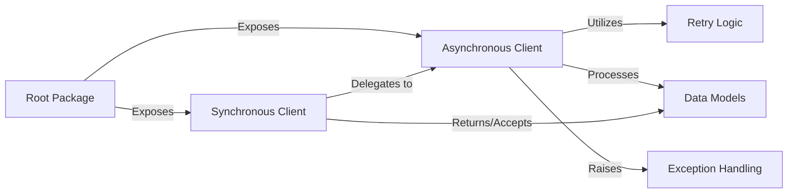

## Details

The `foxops-client-python` project is structured as a Python API Client Library (SDK), adhering to a clear separation of concerns. Its architecture facilitates robust and user-friendly interaction with the Foxops API, supporting both synchronous and asynchronous operations, resilient request handling, and well-defined data structures.

### Root Package

The top-level entry point and orchestrator for the entire client library. It aggregates and exposes the core client functionalities, making them accessible to external applications.

**Related Classes/Methods**:

- `foxops_client` (1:1)

### Asynchronous Client

The primary component for all non-blocking, asynchronous interactions with the Foxops API. It manages HTTP requests, applies retry mechanisms, and processes API responses into defined data models or raises specific exceptions.

**Related Classes/Methods**:

- <a href="https://github.com/Roche/foxops-client-python/blob/main/src/foxops_client/client_async.py#L1-L1" target="_blank" rel="noopener noreferrer">`foxops_client.client_async` (1:1)</a>

### Synchronous Client

Provides a blocking, synchronous interface for API interactions. It acts as a facade, delegating all actual API calls to the `Asynchronous Client` and blocking execution until the asynchronous operation completes.

**Related Classes/Methods**:

- <a href="https://github.com/Roche/foxops-client-python/blob/main/src/foxops_client/client_sync.py#L1-L1" target="_blank" rel="noopener noreferrer">`foxops_client.client_sync` (1:1)</a>

### Data Models

Defines the structured Python data types (DTOs) used for representing entities exchanged with the Foxops API. These models include methods for deserializing JSON API responses into Python objects, ensuring type safety and consistency.

**Related Classes/Methods**:

- <a href="https://github.com/Roche/foxops-client-python/blob/main/src/foxops_client/types.py#L1-L1" target="_blank" rel="noopener noreferrer">`foxops_client.types` (1:1)</a>

### Exception Handling

Centralizes custom exception classes that represent specific API errors (e.g., `AuthenticationError`, `IncarnationDoesNotExistError`). This module provides a structured way to communicate API-related issues to the client application.

**Related Classes/Methods**:

- <a href="https://github.com/Roche/foxops-client-python/blob/main/src/foxops_client/exceptions.py#L1-L1" target="_blank" rel="noopener noreferrer">`foxops_client.exceptions` (1:1)</a>

### Retry Logic

Implements strategies for automatically retrying failed API requests, enhancing the client's robustness against transient network issues or temporary service unavailability. It encapsulates the retry policy, such as exponential backoff or maximum retry attempts.

**Related Classes/Methods**:

- <a href="https://github.com/Roche/foxops-client-python/blob/main/src/foxops_client/retries.py#L1-L1" target="_blank" rel="noopener noreferrer">`foxops_client.retries` (1:1)</a>

### [FAQ](https://github.com/CodeBoarding/GeneratedOnBoardings/tree/main?tab=readme-ov-file#faq)